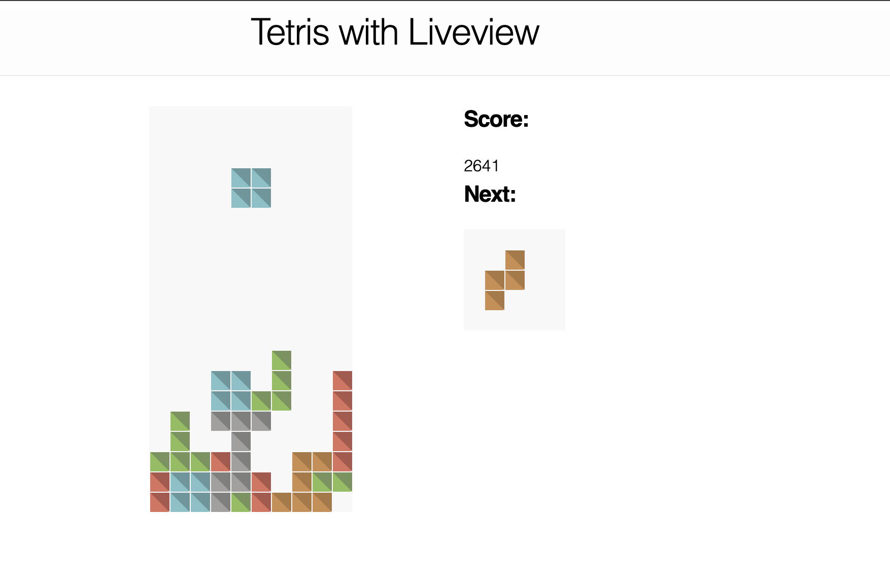

# Tetris GUI implemented using Phoenix LiveView.

This project was developed while following  [Bruce Tate's Quadblock series](https://grox.io/series/quad).

To start your Phoenix server:

  * Install dependencies with `mix deps.get`
  * Install Node.js dependencies with `cd assets && npm install`
  * Start Phoenix endpoint with `mix phx.server`

Now you can visit [`localhost:4000`](http://localhost:4000) from your browser.

The low level game logic can be found [here](https://github.com/crisefd/tetris).

